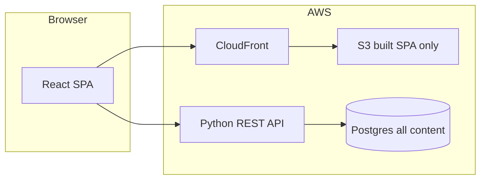

# AWS portfolio stack (DB-backed SPA, Python backend + tooling)

## Goal

A **single-page app** (TypeScript/React) whose **visible data comes from PostgreSQL** via a **REST API** you own. **Server-side code is Python**, not Node.js.

**Node.js on the frontend is expected.** You use it for `package.json`, `npm install`, the Vite dev server, `npm run build`, and front-end tests—that is normal modern web development. The plan only avoids Node as the **production API runtime** (that role is Python). No need to minimize Node on the web side.

## Portfolio UX and design

- **Design:** Intentional, creative front end—typography, layout, motion, and color should feel **authored**, not like a default template. One strong visual idea, everything else supportive; readability and scanability stay primary.
- **Resume on the page:** Same facts as the PDF, loaded from the **API / Postgres** with the rest of the site content.
- **PDF download:** **Canonical, print-friendly resume** as a **primary CTA** (e.g. header or hero)—clear label (e.g. “Download PDF”), optional “last updated” line. Prefer direct download behavior where appropriate.
- **Agent-optimized resume:** A **second link** next to the PDF for tools and agents—e.g. **Markdown** (`resume.md`) and/or **[JSON Resume](https://jsonresume.org/)** JSON. Optional **`/llms.txt`** with a short factual summary and links. Filenames and labels should make the distinction obvious (humans vs machine-readable).
- **Hosting those files:** Ship **PDF + Markdown/JSON** as **static assets** next to the built SPA on S3 (simplest) **or** serve via the API; record the choice in an **ADR**.

## S3 vs the database (two meanings of “assets”)

1. **Built SPA shell (not your portfolio content)** — After `npm run build`, you get **HTML + JavaScript + CSS**. That output is the **application** that runs in the browser. It is commonly uploaded to **S3** and served via **CloudFront** so visitors load the app. That is **hosting the React bundle**, not storing your projects, copy, or images as **business data**.
2. **Your site’s content** — Text, structured fields, and **media** (images, etc.) live in **PostgreSQL** and are served through the **Python API** (e.g. `BYTEA` / `TEXT` for SVG, JSONB for metadata, dedicated `GET` routes for binary media). The React app **fetches** this via HTTP. **Do not put CMS-like content on S3** for this plan.

**Summary:** **S3 + CloudFront = only the compiled frontend (HTML/JS/CSS).** **Postgres = source of truth for everything users see as “the site.”**

**Exception (resume deliverables):** `resume.pdf` and agent files (e.g. `resume.md`, JSON Resume) may ship as **static assets** next to the bundle; **on-page** resume text still comes from **Postgres** via the API unless you explicitly choose otherwise in an ADR.

## Language split

| Layer      | Stack                                                                                    |
| ---------- | ---------------------------------------------------------------------------------------- |
| Browser UI | **Vite + React + TypeScript** (Node for **dev/build only**)                              |
| API        | **Python** — **FastAPI** + **Pydantic**, **SQLAlchemy 2**, **Alembic**                   |
| Automation | **Python** — `scripts/` (**boto3**, `subprocess` for `npm run build`, **terraform** CLI) |
| IaC        | **Terraform** by default; CDK later if you prefer                                        |

## Defaults when you don’t know yet

Starter choices you can swap later (note in an **ADR** when you do):

| Topic         | Default                                                                                                              | Why it’s fine                                                     |
| ------------- | -------------------------------------------------------------------------------------------------------------------- | ----------------------------------------------------------------- |
| Python env    | `python -m venv` + `requirements.txt` (or `pyproject.toml` later)                                                    | Universal, easy to Google                                         |
| API framework | **FastAPI**                                                                                                          | OpenAPI docs, good tutorials                                      |
| DB access     | **SQLAlchemy 2** + **Alembic**                                                                                       | Migrations in git                                                 |
| AWS layout    | **S3 + CloudFront** for **built SPA files only** + **one EC2** + **Docker Compose** (Postgres + API + reverse proxy) | Few services, no NAT by default; **all page content in Postgres** |
| IaC           | **Terraform**                                                                                                        | Lots of AWS examples                                              |
| Scripts       | `scripts/deploy_site.py` etc.                                                                                        | Python-first orchestration                                        |

**Defer:** exact EC2 size, domain, testcontainers vs compose profile—until first real deploy.

## Architecture (default narrative)

- **First page load:** Browser gets **HTML/JS/CSS** from **CloudFront → S3** (the compiled app only).
- **What users read/see as content:** **API → Postgres** (not from S3).
- **SPA code:** `fetch` / TanStack Query to `VITE_API_URL`.
- **API:** FastAPI + Pydantic validation.
- **DB:** PostgreSQL + Alembic migrations under `apps/api` or `db/`.
- **IaC:** Terraform.
- **CI/CD:** GitHub Actions — Node for `apps/web` build; Python for API tests and deploy scripts.

**Alternative with zero S3:** serve the same `dist/` from **nginx/Caddy on the EC2** next to the API (single host, no object storage for the bundle).

## Local and deploy scripts (Python-first)

- `scripts/deploy_site.py` — `npm run build`, upload `dist/` to S3, invalidate CloudFront.
- `scripts/deploy_api.py` / `scripts/compose_on_ec2.py` — per your ADR (SSH, SSM, compose).
- `scripts/seed_db.py` — parse **page content** under `content/` (e.g. Markdown) and upsert into Postgres; lives in `scripts/`, not under `content/`.
- `scripts/smoke.py` — `/health` + one content GET after deploy.

Document e.g. `python -m scripts.deploy_site` in the README.

## Deployment default

- **Option A:** One **EC2** + **Docker Compose**: Postgres + Python API + reverse proxy; SPA either **S3 + CloudFront** or **static files from the same EC2**.
- **Option B:** S3/CloudFront + **RDS** + API on App Runner / ECS Fargate / etc.

Avoid **Lambda + private RDS + NAT** as the first milestone unless you budget NAT/VPC endpoints.

## `content/` folder

**Only authoring files for real site copy** (e.g. Markdown with optional YAML front matter per page). Do **not** add subfolders like `content/seeds` or `content/fixtures`—those were a mistake. No seed scripts, SQL dumps, or test fixtures here; those belong under **`scripts/`** and **`tests/fixtures/`** (or `apps/api/tests/fixtures/`) respectively. The script `scripts/seed_db.py` **seeds** the DB by **reading page files from `content/`**—it is not a “seeds” folder inside `content/`.

- **Runtime:** production still reads **only Postgres** via the API; `content/` is the git-friendly **source** you edit and optionally load with `scripts/seed_db.py`.
- **Tests:** JSON or other **pytest fixtures** live next to tests (e.g. `tests/fixtures/`), not in `content/`.

## Seeding and test fixtures (where they live)

“Seeds” and “fixtures” still exist—they are just **not** under `content/`. Use this layout:

| What | Where | Notes |
|------|--------|--------|
| **Seed script** | `scripts/seed_db.py` (or `python -m scripts.seed_db`) | Orchestrates loading authoring files into Postgres. |
| **Seed input (page copy)** | `content/` | Markdown (etc.) you author; this **is** the data you seed from—no separate `content/seeds/` folder. |
| **Optional SQL-only seed snippets** | e.g. `scripts/sql/` or next to Alembic under `apps/api/` | Only if you need raw SQL for dev; keep out of `content/`. |
| **Pytest fixtures** | `tests/fixtures/` or `apps/api/tests/fixtures/` | JSON blobs, expected API responses, tiny datasets for tests—not production page copy. |

So: **seeding** = script in **`scripts/`** + **authoring files in `content/`**. **Fixtures** = **`tests/fixtures/`** (or under the API test tree).

## Implementation phases

1. Local: Docker Compose (Postgres + API); SPA dev with CORS/proxy to API.
2. API + DB: read routes; Alembic; `scripts/seed_db` ingests **page files** from `content/` into Postgres.
3. Scripts: `deploy_site` + env vars (`AWS_PROFILE`, bucket, distribution ID).
4. IaC + CI: Terraform; GitHub Actions + OIDC.

## Testing

- **API:** pytest + httpx `TestClient` + Postgres (compose or testcontainers).
- **Web:** Vitest (front-end only).

## What we are not doing

- **Node.js on the backend.**
- **Storing portfolio content (text/media) on S3** — that belongs in **Postgres** for this plan.

