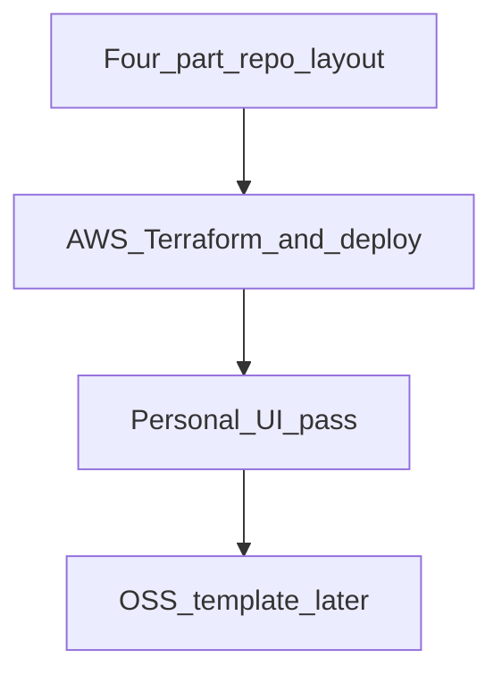

# Repo organization, then AWS pipeline

## Scope now

- **In scope:** Four-part directory layout so consumers can conceptually (and eventually practically) use **only web**, **only resume PDF tooling**, **only backend/infra**, or **authoring under `content/`** alone; then **Terraform + deploy** on AWS.
- **Out of scope for this iteration:** OSS parameterization, generic placeholders, template repo publish (Phase 2).

---

## `content/` layout (authoring + OSS docs)

Keep a single top-level **`content/`** folder with two subfolders:

| Subfolder | Purpose |
|-----------|---------|
| **`content/personal/`** | Your site pages and résumé source: `home.md`, `resume.md`, `writing-samples.md`, `resume.contact.example.md`, and gitignored `resume.contact.local.md`. |
| **`content/docs/`** | OSS / project documentation (architecture, deploy, customization, ADRs). Placeholder can be `content/docs/.gitkeep` until you write real docs. |

This avoids a flat `personal/` at repo root and keeps everything “copy” under **`content/`**.

---

## Four-part target layout (full monorepo)

| Part | Role | Suggested path (after move) |
|------|------|------------------------------|
| **Backend** | AWS Terraform, FastAPI app, deploy/bootstrap scripts | `backend/terraform/`, `backend/api/`, `backend/scripts/` |
| **Web** | Vite + React SPA | `web/` (from `apps/web/`) |
| **Resume** | Markdown → PDF pipeline | `resume/` — scripts + CSS |
| **Content** | Authoring + OSS docs | **`content/personal/`**, **`content/docs/`** |

**Root** README points to each part and optional use (“Résumé PDF only: see `resume/README.md`”).

### Coupling notes

- **`seed_db.py`** should read page Markdown from **`content/personal/*.md`** (same as today’s seed behavior, but nested).
- **`render_resume_pdf.mjs`** paths: `content/personal/resume.md`, `content/personal/writing-samples.md`, `content/personal/resume.contact.local.md`.
- **`.gitignore`:** `content/personal/resume.contact.local.md`.

---

## Migration checklist (implementation order)

0. Ensure **`content/personal/`** holds all former flat-`content/` (or `personal/`) Markdown; ensure **`content/docs/.gitkeep`** exists. Remove duplicate `personal/` at repo root or root `docs/` if introduced by mistake.
1. Update **`seed_db.py`**, **`render_resume_pdf.mjs`**, **`apps/web/package.json`** resume scripts, **`.gitignore`**, **`content/personal/resume.contact.example.md`** text, **`README.md`** to use **`content/personal/`** and **`content/docs/`**.
2. Later: `git mv` infra → `backend/terraform`, apps → `web` / `backend/api`, etc., per the broader four-part reorg.

---

## AWS pipeline (after reorg paths are stable)

- **Existing:** `infra/terraform/main.tf` — S3 + OAC + CloudFront.
- **Runbook:** Terraform apply → env vars → build SPA → optional PDF generation → `deploy_site.py`.

---

## Phase 2 — OSS template (deferred)

Parameterization and public template repo after personal site is live.

---

## Dependency order

---

## Path reference (target)

- Seeded pages + résumé sources: **`content/personal/*.md`**
- OSS documentation: **`content/docs/`**
- Scripts: `scripts/` (until moved under `backend/`)
